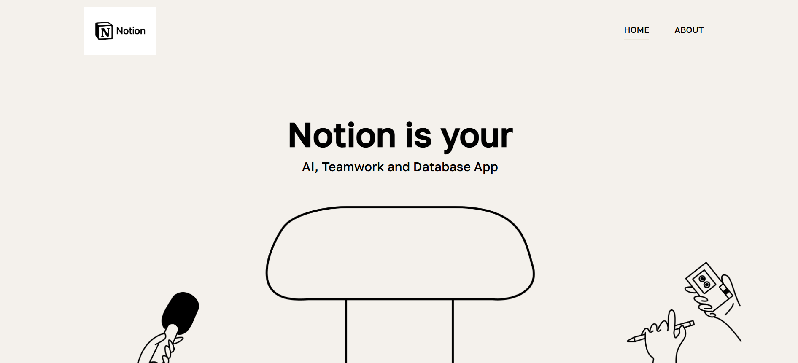
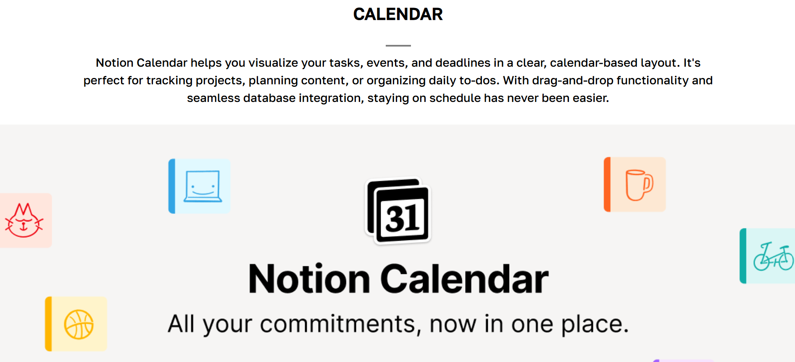
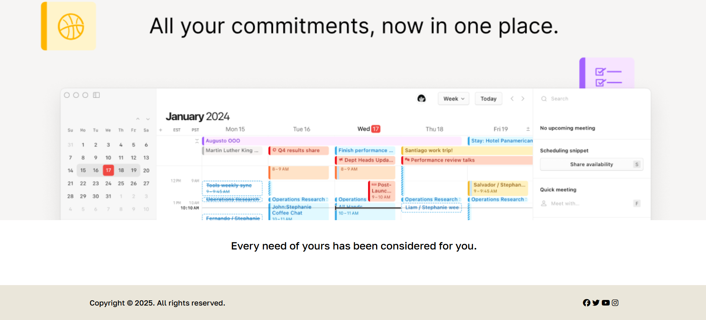
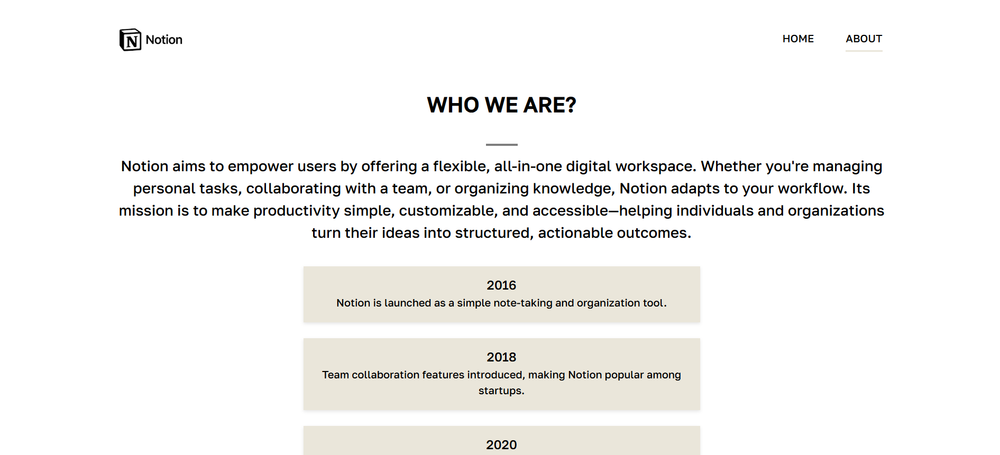
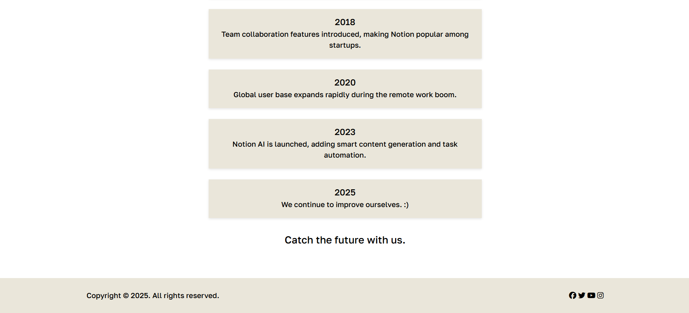

# 🧠 Notion Landing Page

This is a simple, clean, and informative landing page project designed to showcase the features of **Notion**, a powerful all-in-one productivity tool.

## 🚀 Project Features

- Responsive design with SCSS architecture
- Introduction to Notion's core capabilities
- Calendar feature section
- Clean About page with a vertical timeline
- Scroll animations using ScrollReveal.js
- Social media footer with Font Awesome icons

## 🛠️ Technologies Used

- HTML5
- SCSS (Modular structure)
- Font Awesome (for icons)
- ScrollReveal.js (for animations)
- Google Fonts (via Adobe Fonts - Typekit)

## 🧩 How to Use

1. Make sure you have **Node.js** and **npm** installed on your machine.
2. Clone or download the repository.
3. `"scripts": { "scss": "sass --watch --style=compressed scss:public/css"
}`
4. Compile the SCSS files to CSS (e.g., using `npm run scss` ).
5. Open `index.html` or `about.html` in your browser.

## 📸 Screenshots

### 🏠 Home Page

### 📄 About Page

> ⚠️ _This project is currently not fully responsive. Mobile support will be added in upcoming updates._

## 📬 Contact

Feel free to reach out for suggestions, improvements, or collaborations!
